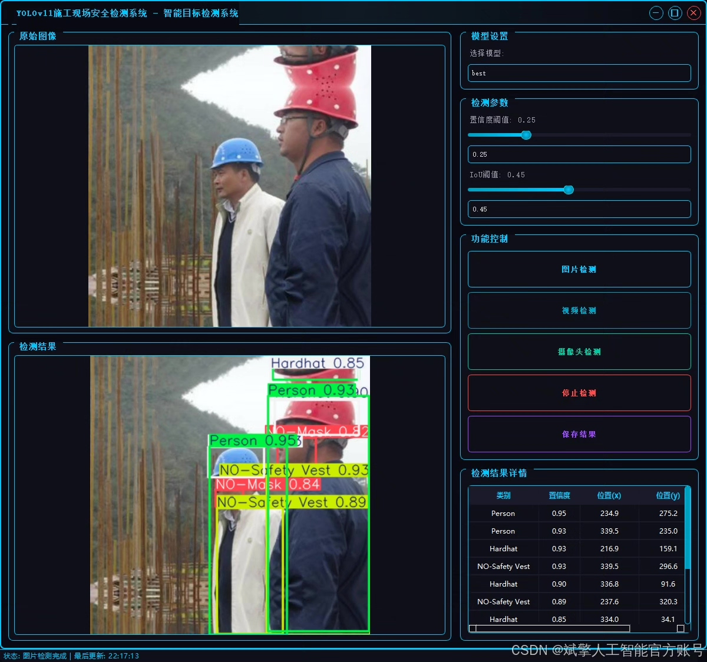
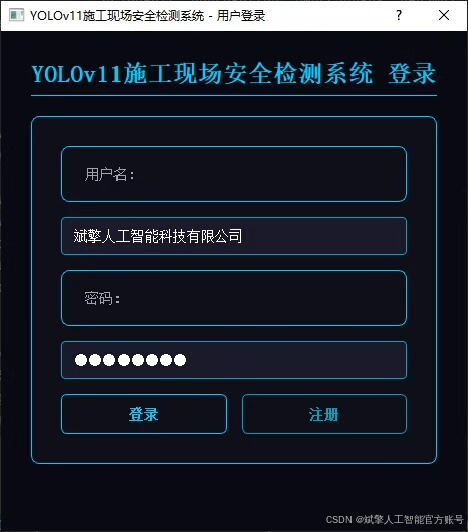
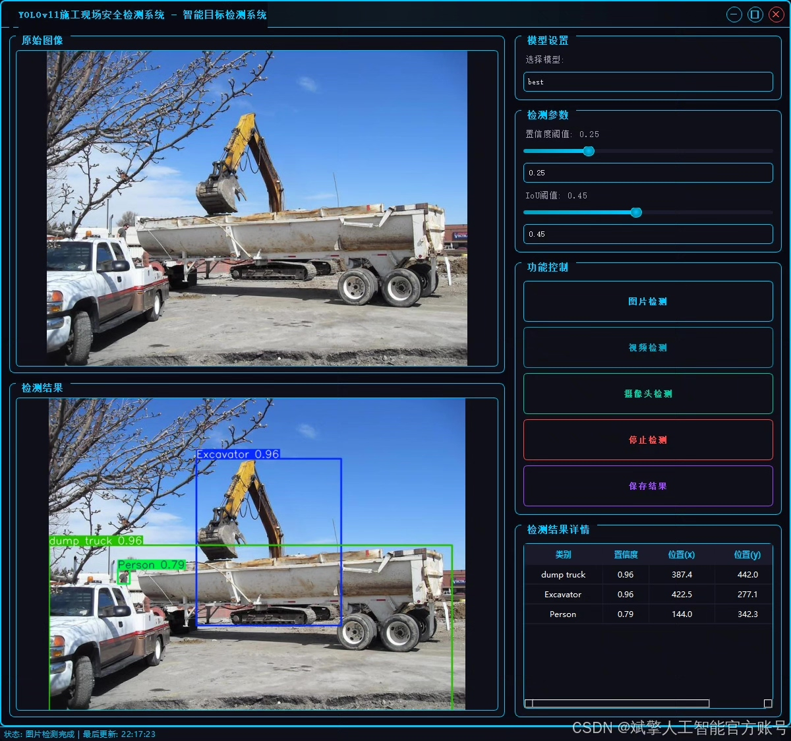
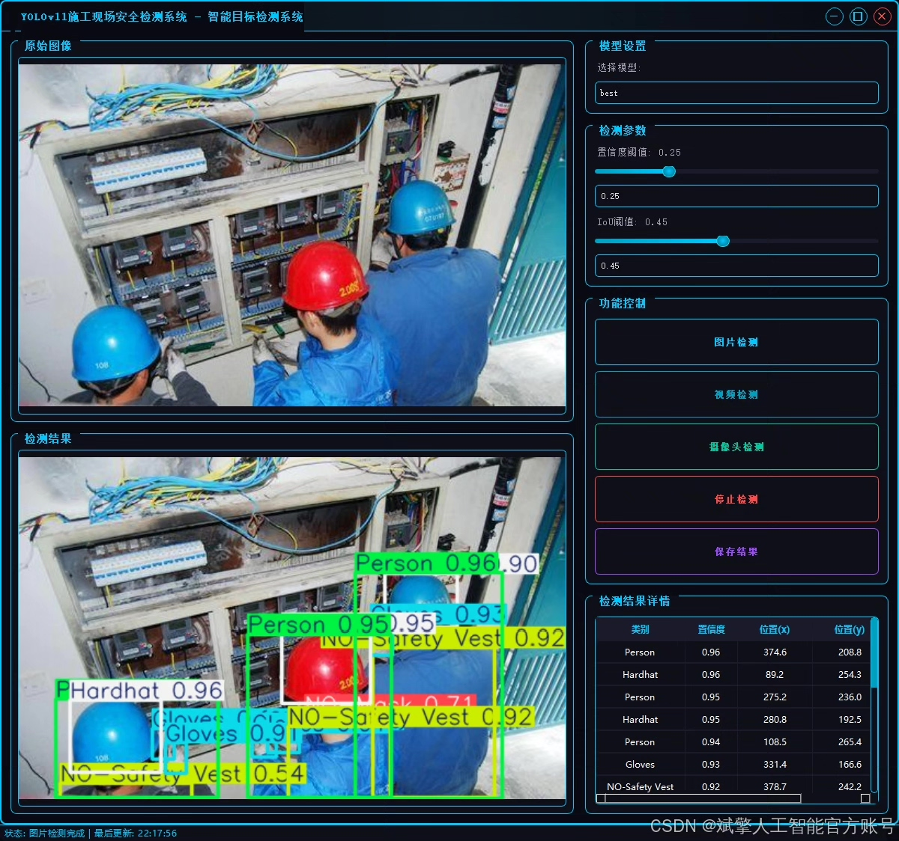
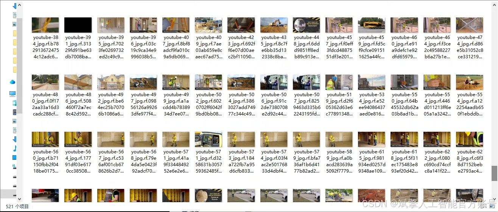
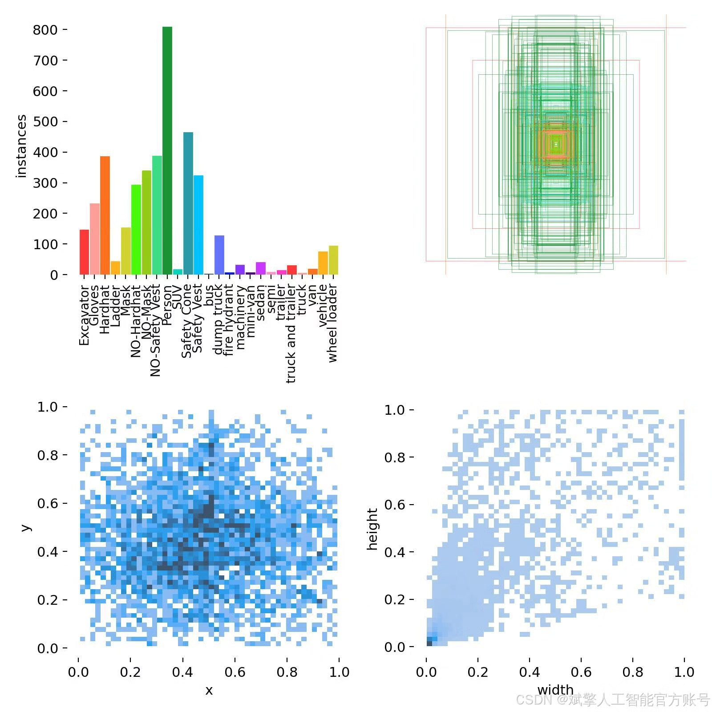
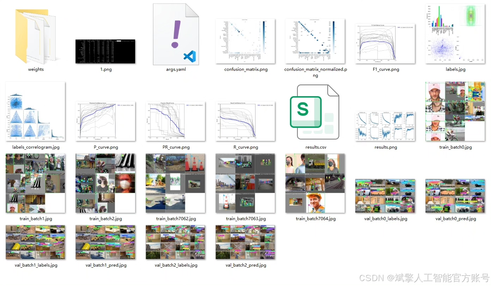
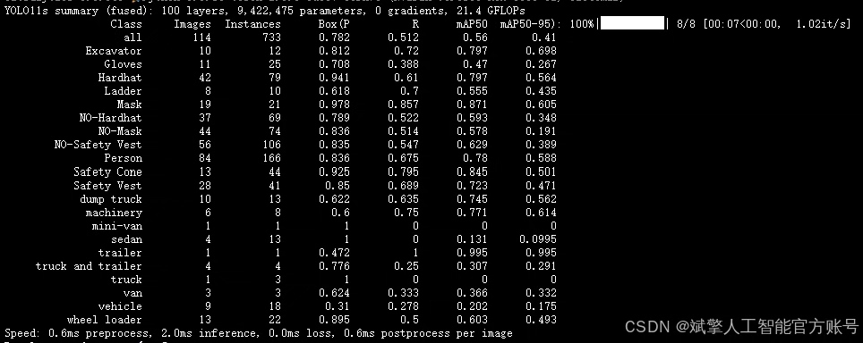
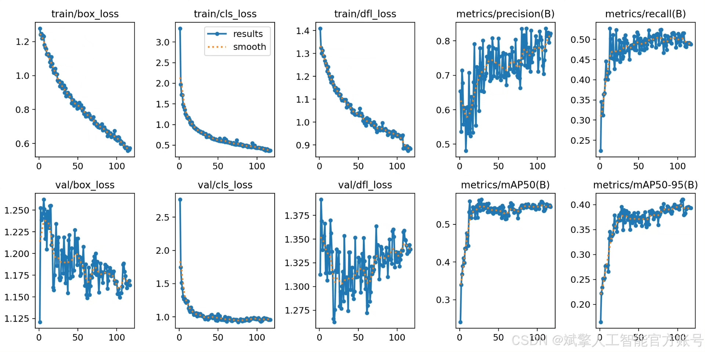

# YOLOv11 Construction Safety Detection Software Resources

## Body

YOLOv11 Construction Safety Detection Software Resources Share
Based on Deep Learning YOLOv11, a construction site safety detection system (YOLOv11+YOLO dataset + UI interface + login registration interface + Python project source code + model)

Construction site safety management is a key link to ensure the safety of workers and the smooth progress of projects. The traditional manual patrol methods are inefficient and prone to omissions, while intelligent detection technology based on computer vision can identify safety hazards in real-time and accurately. This paper proposes a construction site safety detection system based on the YOLOv11 deep learning model, which can automatically detect targets in 25 construction scene classes (such as safety helmets, reflective clothing, excavators, etc.), and mark violations (such as not wearing a safety helmet or mask). The system is developed using Python, integrates a user-friendly UI interface and login registration functions, supports real-time video and image analysis.

Dataset:
nc: 25
names: ['Excavator', 'Gloves', 'Hardhat', 'Ladder', 'Mask', 'NO-Hardhat', 'NO-Mask', 'NO-Safety Vest', 'Person', 'SUV', 'Safety Cone', 'Safety Vest', 'bus', 'dump truck', 'fire hydrant', 'machinery', 'mini-van', 'sedan', 'semi', 'trailer', 'truck and trailer', 'truck', 'van', 'vehicle', 'wheel loader'],
dataset quantity: 521 training sets, 114 validation sets, 82 testing sets.

✅ User login registration: Support password detection and security verification.
✅ Three detection modes: Based on the YOLOv11 model, support image, video, and real-time camera detection, accurately recognize targets.
✅ Dual-screen comparison: Display original images and detection results on the same screen.
✅ Data visualization: Real-time table displaying the category, confidence, and coordinates of detected targets.
✅ Intelligent parameter adjustment: Provide a confidence slide bar, dynamically optimize detection accuracy to meet different scene needs.
✅ Sci-fi style interactive interface: Dark theme combined with dynamic light effects, reduce visual fatigue, improve operational experience.

## Images

## Payment

Here is a pay link on Stripe ( https://buy.stripe.com/3cs8yP7sY87d0vu9AB ). Please contact me lonlonago@foxmail.com after funding $89, and I will send you a complete data files , thank you!

